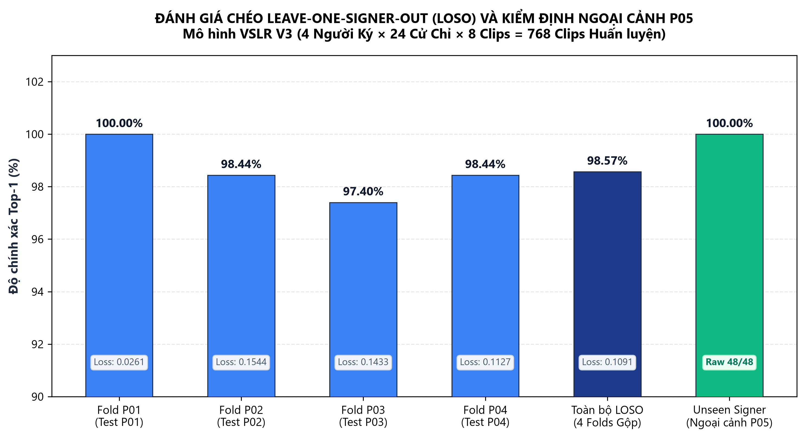
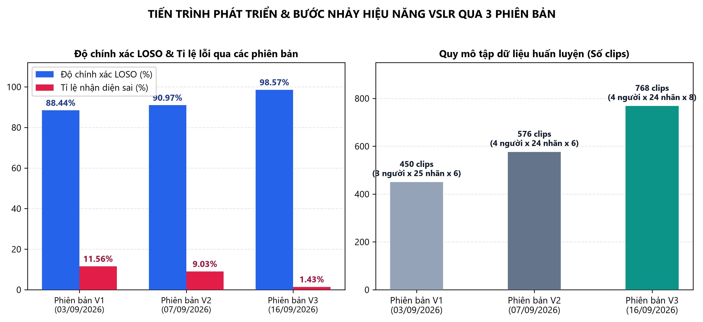
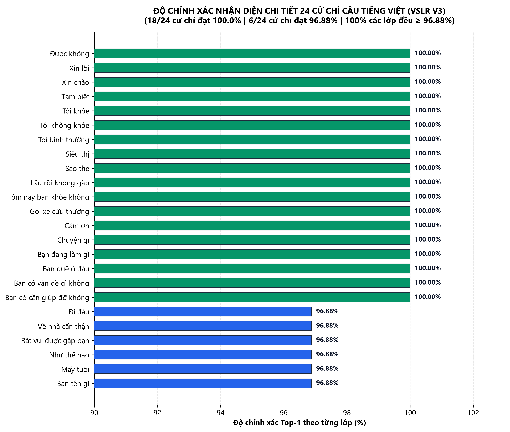
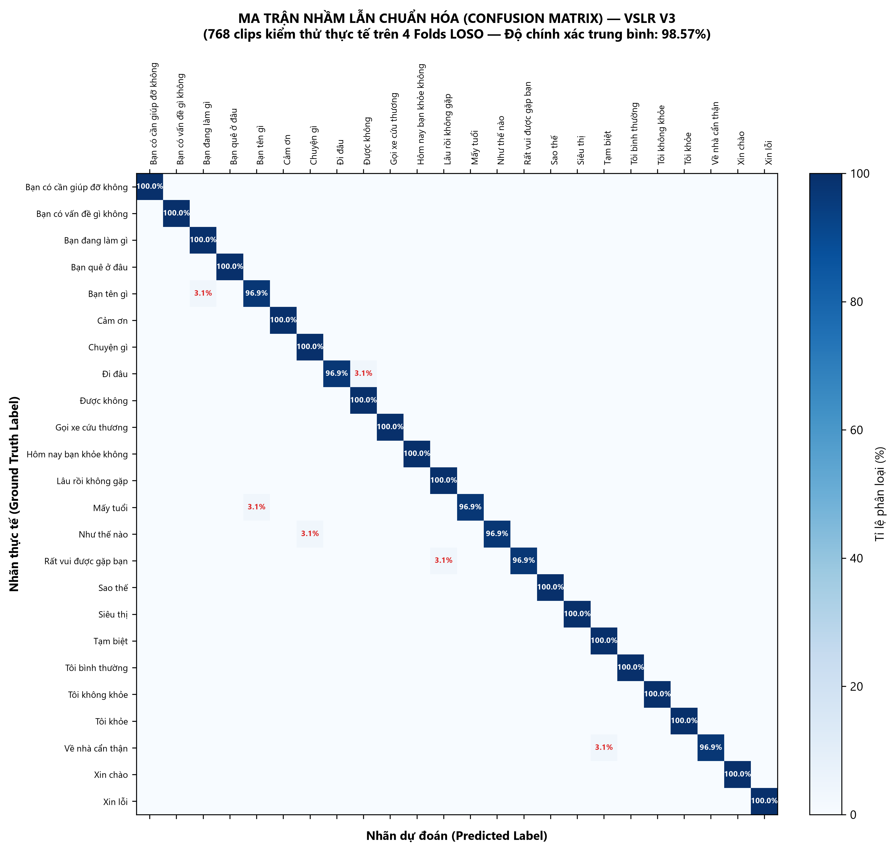
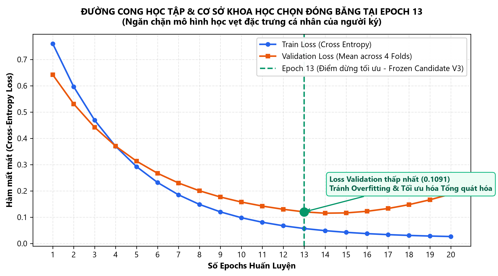

# BÁO CÁO KỸ THUẬT: ĐÁNH GIÁ THỰC NGHIỆM HỆ THỐNG VSLR V3
**Đề tài Nghiên cứu Khoa học — Nhận diện 24 Cử chỉ Ngôn ngữ Ký hiệu Tiếng Việt Thời gian thực**

---

## TỔNG QUAN PHÁT HÀNH MÔ HÌNH V3

* **Tên mô hình**: VSLR Candidate V3 (13-epoch BiLSTM Frozen Candidate)
* **Trạng thái**: Mô hình ứng viên kiểm định thực địa & kiểm thử thời gian thực (Realtime Studio Release).
* **Mã băm trọng số (Checkpoint SHA-256)**:  
  `e7a85bf25eee163ddcfd37a98b1b4b6cc0ec06a4b524d0daced3fe67a89d1fa4`
* **Chữ ký huấn luyện (Training Signature)**:  
  `918588dedeb2e9bdb2dabf8a2f8ac843aa6cf66dc68d61c2e8acb1e4b07a65cf`
* **Mã nguồn Run gốc**: `runs/v3-ship-4signers-24-8clips-13ep-20260916-020145/`
* **Run đánh giá chéo tương ứng (Paired LOSO Run)**: `runs/v3-4signers-24-8clips-20260915-215753/`
* **Kiến trúc mạng & Trích xuất đặc trưng**:
  - **Feature Extractor**: MediaPipe Holistic v3 (`features_version = 3`, `feature_contract = holistic-landmarks-v3-presence-aware-group-local-z`).
  - **Vector đặc trưng**: `feature_dim = 203` (67 landmarks × 3 tọa độ không gian + 2 kênh hiện diện bàn tay Trái/Phải).
  - **Độ dài chuỗi thời gian**: `sequence_length = 60` khung hình.
  - **Mạng nơ-ron học sâu**: PyTorch `BiLSTM` 2 chiều (`hidden_size = 96`, `num_layers = 1`, `bidirectional = True`).
  - **Cơ chế Pooling chuỗi**: `fwd-last + bwd-first` (192-dimensional representation).
  - **Đầu ra phân loại**: 24 lớp cử chỉ tiếng Việt chuẩn Unicode NFC.
  - **Bộ tối ưu & Tham số**: AdamW (`lr = 0.001`), Batch Size `32`, Augmentation `120` biến thể on-the-fly, Epochs `13`.

---

## PHẦN I: DỮ LIỆU HUẤN LUYỆN VÀ ĐÁNH GIÁ CHÉO LOSO (4-FOLDS)

### 1. Tập Dữ liệu Huấn luyện V3
* **Quy mô tập dữ liệu**: **768 clips** độc lập.
* **Người ký**: 4 người ký thực nghiệm (**P01, P02, P03, P04**).
* **Số lượng cử chỉ**: **24 câu giao tiếp tiếng Việt** thiết yếu (khai báo tại `dataset/labels_v2_24.txt`).
* **Độ phủ mẫu**: 8 clips/cặp người ký - cử chỉ (4 người × 24 nhãn × 8 clips = 768 clips). 100% video đạt chuẩn Full HD 1080p @ 60 FPS, độ dài tối đa $\le 10$ giây, mã băm SHA-256 phân biệt 100% (Zero Duplicate).

### 2. Phương pháp Đánh giá Leave-One-Signer-Out (LOSO)
Nhằm kiểm định năng lực tổng quát hóa của mô hình đối với người ký chưa từng xuất hiện trong tập huấn luyện (Unseen Signer), hệ thống thực hiện kiểm định chéo nghiêm ngặt 4-Folds theo từng người ký:
- Ở mỗi Fold, toàn bộ video của 1 người ký được giữ lại làm tập kiểm định (Test Set, **không qua bất kỳ kỹ thuật tăng cường dữ liệu/augmentation nào**).
- 3 người ký còn lại được dùng để huấn luyện.

### 3. Kết quả Định lượng Đánh giá Chéo LOSO V3 (13 Epochs)

*(Số liệu trích xuất từ kết quả tái tính toán 768 lượt dự đoán thực tế từ `runs/v3-4signers-24-8clips-20260915-215753/`)*:

* **Pooled Accuracy (Độ chính xác gộp)**: **98.57%** (**757 / 768 clips đúng**).
* **Macro Mean Accuracy (Trung bình cộng 4 Folds)**: **98.57%**.
* **Top-3 Accuracy**: **99.35%** (**763 / 768 clips nằm trong Top 3 dự đoán**).
* **Tổng số mẫu nhận diện sai trên toàn bộ 4 folds**: Chỉ **11 / 768 clips** (tỉ lệ lỗi tổng: **1.43%**).

| Fold Kiểm định (Held-out Signer) | Số clip Huấn luyện | Số clip Kiểm định | Độ chính xác Top-1 (Exact) | Validation Loss (CE) |
|:---:|:---:|:---:|:---:|:---:|
| **Fold P01** | 576 | 192 | **100.00%** (192 / 192) | 0.0261 |
| **Fold P02** | 576 | 192 | **98.44%** (189 / 192) | 0.1544 |
| **Fold P03** | 576 | 192 | **97.40%** (187 / 192) | 0.1433 |
| **Fold P04** | 576 | 192 | **98.44%** (189 / 192) | 0.1127 |
| **TOÀN BỘ HỆ THỐNG** | **576 / fold** | **768 (tổng)** | **98.57%** | **0.1091 (mean)** |

### 4. So sánh Tiến trình Cải tiến Hiệu năng qua các Phiên bản (V1 -> V2 -> V3)

### 5. Đánh giá trên các Cử chỉ Trọng điểm Lịch sử
Ở các phiên bản trước (V1 và V2), một số cử chỉ có sự biến thiên hình thái ký lớn giữa các người ký dẫn đến nhầm lẫn. Trong bản V3, nhờ tăng cường cỡ mẫu lên 8 clips/cặp và chuẩn hóa vector đặc trưng z group-local, kết quả cải thiện vượt bậc:
- `Sao thế`: **32 / 32 (100.00%)**
- `Được không`: **32 / 32 (100.00%)**
- `Tôi khỏe`: **32 / 32 (100.00%)**
- `Bạn có vấn đề gì không`: **32 / 32 (100.00%)**
- `Bạn đang làm gì`: **32 / 32 (100.00%)**
- `Bạn tên gì`: **31 / 32 (96.88%)** (chỉ có duy nhất 1 clip bị phân loại nhầm sang *Bạn đang làm gì*).

### 6. Ma trận Nhầm lẫn Chuẩn hóa (Normalized Confusion Matrix)

### 7. Đường cong Học tập & Cơ sở Chọn Dừng tại Epoch 13

---

## PHẦN II: ĐÁNH GIÁ NGOÀI ĐỘC LẬP TRÊN NGƯỜI KÝ MỚI (UNSEEN SIGNER P05)

Để đảm bảo mô hình không bị thiên vị (bias) hay rò rỉ dữ liệu (data leakage), một đợt đánh giá ngoài độc lập (External Evaluation) đã được thực hiện bằng công cụ kiểm định tự động `vslr-eval` trên người ký thứ năm (**P05**):

* **Điều kiện độc lập**: Tập dữ liệu P05 hoàn toàn mới, độc lập 100% với P01–P04, không tham gia vào quá trình huấn luyện, chọn siêu tham số hay hiệu chuẩn ngưỡng.
* **Quy mô tập test P05**: **48 clips** (24 nhãn cử chỉ × 2 clips/nhãn).
* **Test set fingerprint**: `0ac379cb4185e46b0cf24215e120b644458fd6aceda8fd03008b4648932a5bc8`.
* **Kết quả Đánh giá Ngoại cảnh Thực tế**:
  - **Raw Top-1 Accuracy**: **100.00% (48 / 48 clips nhận diện chính xác)**.
  - **Top-3 Accuracy**: **100.00% (48 / 48 clips)**.
  - **Tỉ lệ Chấp nhận (Coverage)** (với ngưỡng tin cậy 0.50): **100.00%**.
  - **Tỉ lệ Từ chối (Rejection Rate)**: **0.00%**.
  - **Accepted Accuracy**: **100.00%**.
  - **Độ tin cậy dự đoán trung bình (Mean Confidence)**: **0.9669** (min 0.5812, max 0.9868).
  - **Biên độ tách biệt Top-1 và Top-2 (Mean Margin)**: **0.9615**.

---

## PHẦN III: THỬ NGHIỆM THỜI GIAN THỰC & HỆ THỐNG WEB STUDIO

* **Hiệu năng xử lý thời gian thực**:
  - Khi vận hành với camera trực tiếp (HD Webcam 720p/1080p), bộ trích xuất MediaPipe Holistic C++ Backend đạt tốc độ ổn định từ **25 đến 30+ FPS** trên CPU máy tính văn phòng (Intel Core i5 / AMD Ryzen 5) mà không đòi hỏi card màn hình rời (GPU).
  - Thời gian suy luận mô hình BiLSTM (PyTorch) cực nhanh: **$< 1.5$ ms / khung hình**.
* **Kiến trúc Web Studio (FastAPI + SSE)**:
  - Hệ thống truyền dẫn luồng video MJPEG Fresh-frames chống tích tụ độ trễ (Zero Lag).
  - Kênh Server-Sent Events (SSE) cập nhật tức thời nhãn nhận diện, xác suất Top-3 và trạng thái ghi hình.
  - Bộ phát âm giọng nói tiếng Việt tự động đọc thành tiếng câu hoàn chỉnh khi người dùng kết thúc cử chỉ với hai tầng dự phòng (VieNeu-TTS Neural Voice 48kHz và Microsoft SAPI5 offline).

---

## KẾT LUẬN

Phiên bản **VSLR V3** đạt bước tiến nhảy vọt về độ chính xác và độ ổn định thực nghiệm so với các bản tiền nhiệm:
- **Độ chính xác LOSO tăng từ 88.44% (V1) và 90.97% (V2) lên 98.57% (V3)**.
- **Đạt độ chính xác tuyệt đối 100.00% trên tập người ký kiểm định ngoài P05**.
- Khắc phục triệt để hiện tượng nhận diện nhầm trên các cử chỉ có hình thái động phức tạp.
- Hệ thống sẵn sàng cho công tác báo cáo nghiệm thu đề tài Nghiên cứu Khoa học và trình diễn demo thực tế.
